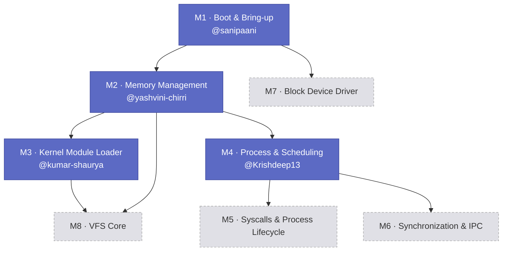

# KraftOS

A 64-bit x86 kernel built from scratch, module by module, in C/C++. This
site aggregates the docs from every module's own repo — each module is a
submodule with its own `docs/` folder; see [Writing docs](writing-docs.md)
and [Adding your project](https://github.com/KernelKraftVITC/KraftOS/blob/pages/CONTRIBUTING.md)
for how that works.

## Tech stack

- **Language:** C, with C++ where it earns its keep (no exceptions, no RTTI)
- **Freestanding** — no libc, no hosted runtime; everything from boot up is
  ours
- **Bootloader:** [Limine](https://github.com/limine-bootloader/limine)
- **Toolchain:** a cross-compiler targeting `x86_64-elf` (never the system
  compiler)
- **Testing:** QEMU, cross-checked against real hardware where it matters

## Current team — M1 to M4

The first four modules are in active development. One person per module,
one repo per module.

| Module | Scope | Owner | Repo |
|---|---|---|---|
| M1 | Boot & Bring-up | [@sanipaani](https://github.com/sanipaani) | [kraft-boot-bringup](https://github.com/KernelKraftVITC/kraft-boot-bringup) |
| M2 | Memory Management | [@yashvini-chirri](https://github.com/yashvini-chirri) | [kraft-memory-management](https://github.com/KernelKraftVITC/kraft-memory-management) |
| M3 | Kernel Module Loader (LKM) | [@kumar-shaurya](https://github.com/kumar-shaurya) | [kraft-kernel-module-loader](https://github.com/KernelKraftVITC/kraft-kernel-module-loader) |
| M4 | Process & Scheduling | [@Krishdeep13](https://github.com/Krishdeep13) | [kraft-process-scheduling](https://github.com/KernelKraftVITC/kraft-process-scheduling) |

## Dependency graph

M1 is the foundation everything boots from. M2 (memory) is the hard
prerequisite for both M3 and M4 — those two can then proceed **in
parallel**, since the module loader and the scheduler don't depend on each
other. Later modules (M5 onward, not yet assigned) build on top of M3/M4.

## Full roadmap

The kernel is planned as twelve modules; only M1–M4 are staffed so far.

1. **M1 — Boot & Bring-up** — toolchain, Limine boot into long mode,
   framebuffer/serial, GDT/TSS, IDT, PIC/APIC + timer, keyboard driver
2. **M2 — Memory Management** — physical frame allocator, paging
   (4-level, higher-half), kernel heap (`kmalloc`/`kfree`)
3. **M3 — Kernel Module Loader (LKM)** — relocatable ELF (`.ko`-style)
   parsing, kernel symbol table, register/init/cleanup API,
   `insmod`/`rmmod`-style loading
4. **M4 — Process & Scheduling** — thread abstraction + context switch,
   round-robin scheduler, ring-3 user mode transition
5. **M5 — System Calls & Process Lifecycle** — syscall ABI/dispatch, core
   syscalls (`write`, `exit`, `getpid`), ELF loader, `fork`/`exec`/`wait`
6. **M6 — Synchronization & IPC** — spinlock, mutex, pipes
7. **M7 — Block Device Driver** — virtio-blk or ATA, read/write requests,
   interrupt-driven I/O completion
8. **M8 — VFS Core** — inode/file abstraction, mount + path resolution,
   file syscalls (`open`, `read`, `write`, `close`, `lseek`)
9. **M9 — Filesystem: ext2** — read support, write support, FAT (stretch)
10. **M10 — Userland & Shell** — minimal C library, shell (init process),
    coreutils (`ls`, `cat`, `echo`)
11. **M11 — Graphics & Basic UI** — framebuffer compositor, window
    manager, input routing, minimal widget toolkit
12. **M12 — Extra Modules** *(optional, for early finishers)* — SMP,
    xfs/btrfs read-only study, basic networking, demand paging / CoW fork
